# TIL-JUNGLE

TIL-JUNGLE은 오늘 자신이 학습하고 기록한 TIL(Today I Learned) 포스팅을 공유하고, 소통할 수 있는 웹 서비스입니다. <br>
TIL-JUNGLE Slack 워크스페이스에 참여한 후, TIL 작성자와 질문하기를 통해 본인이 궁금한 내용들을 private하게 대화할 수 있습니다. <br>
크래프톤 정글 인원들이 대화를 나누며 공부한 내용을 Q&A 게시판에 공개하여 함께 성장하는 환경을 만들고자 하였습니다.


## 👨‍💻 팀
크래프톤 정글 10기 Week00 Team 11

| 이름 | [박도현](https://github.com/hyeondxo)| [이승헌](https://github.com/lsh0927) | [김도훈](https://github.com/sisyphusman) |
| :-: | :-: | :-: | :-: |
| 프로필 |  |  |  |
| 역할 | 1. 화면 별 SSR/CSR 기능<br> 2. 검색/무한스크롤 카드 렌더링 기능 <br> 3. URL 검증 및 TIL 카드 생성 기능 <br> 4. 마이페이지 데이터 바인딩 | 1. 서버 구축 <br> 2. 슬랙 계정 연동 및 로그인 기능  <br> 3. 질문하기, 대화수집 기능 <br> 4. Q&A 게시판 제작 및 비공개 대화 공개 기능 | 1. 슬랙 API 초기 구축 <br> 2. bs4 썸네일 크롤링 기능 <br> 3. 카드 검색 기능 <br> 4. 사용자 별 데이터 수집 기능 |

## 주요 페이지

|        로그인         |        회원가입        |
| :------------------: | :--------------------: |
| 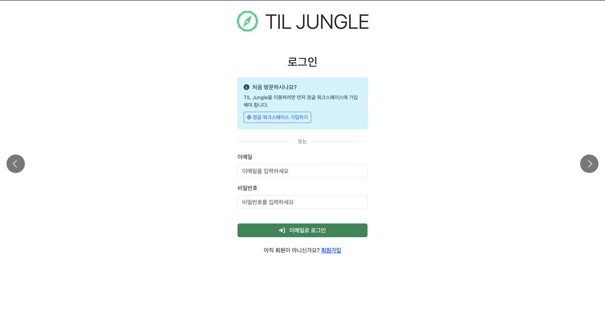 | 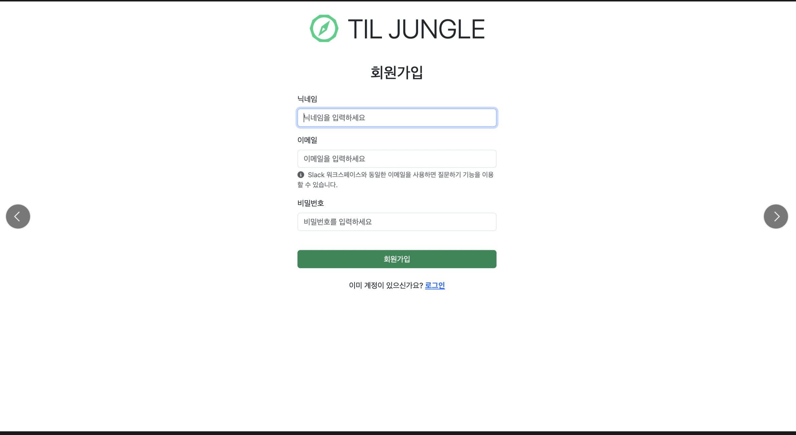 |

|         Slack 워크스페이스 참여         |        Slack 로그인        |
| :------------------: | :--------------------: |
| 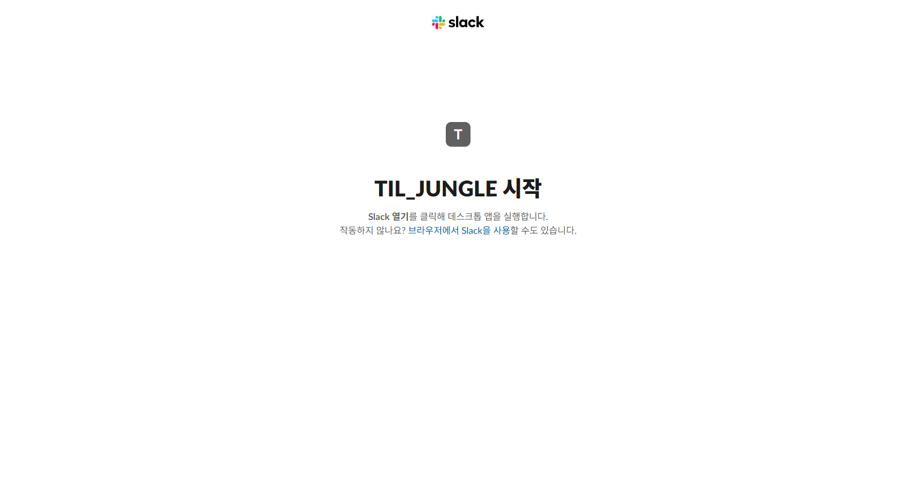 | 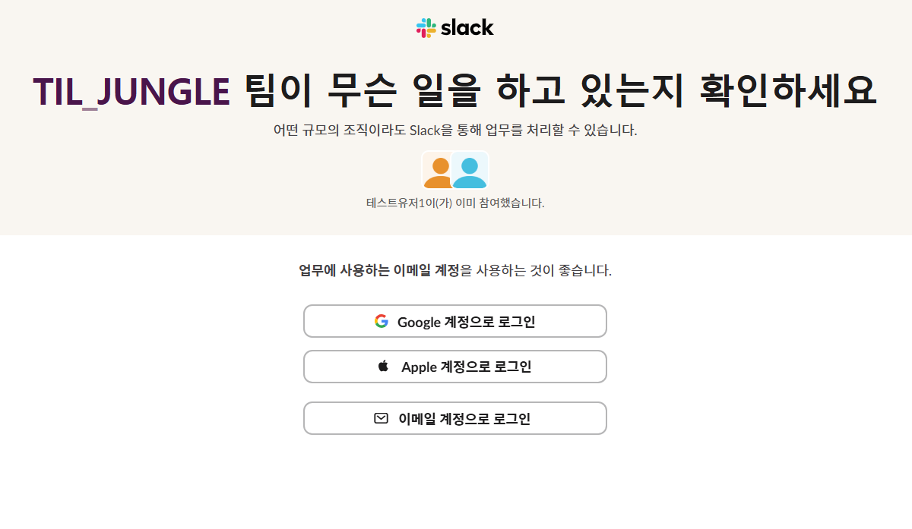 |

|        이메일 인증         |        인증 코드 확인        |
| :------------------: | :--------------------: |
| 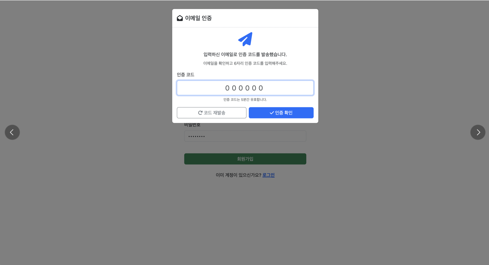 | 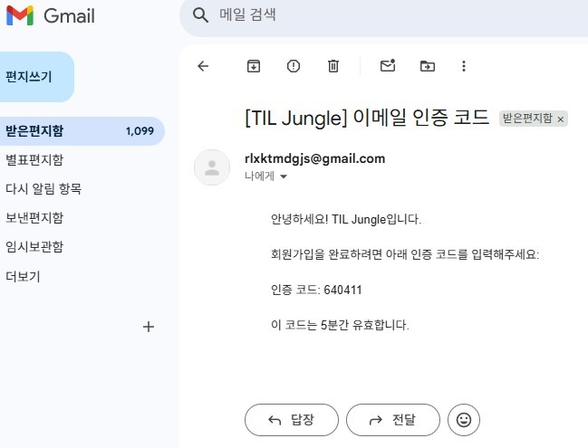 |


## TIL 

|        메인         |         원본 링크 이동        |
| :------------------: | :--------------------: |
| 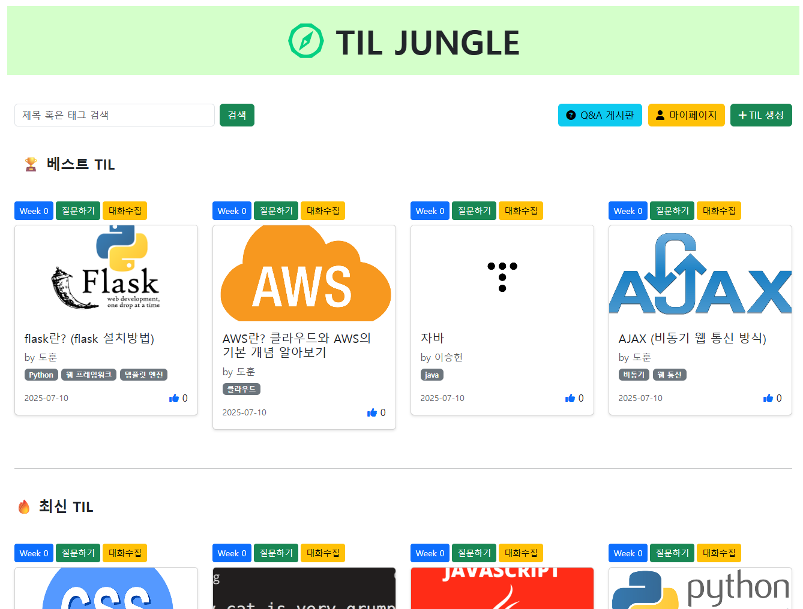 | 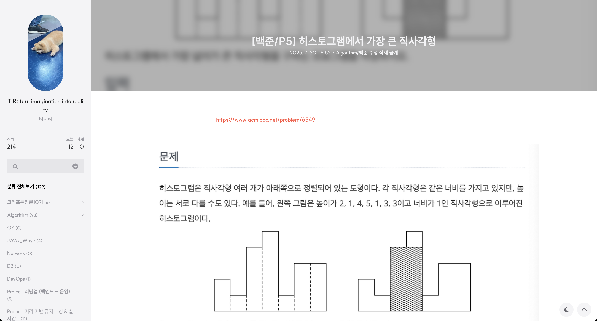 |


BEST TIL : 좋아요 순 상위 4개의 TIL 정렬 <br>
최신 TIL : 가장 최근 생성된 TIL 정렬 <br>
카드 클릭 시 원본 링크로 이동

- **SSR을 통한 초기 페이지 렌더링, 이후 나타나는 TIL은 CSR을 통해 무한 스크롤 구현**
- **bs4 웹 크롤링을 통한 TIL 카드 썸네일 자동 생성**
- **태그 등록 시 검색 쿼리의 대상에 포함되어 검색 결과로 노출**

|        TIL 카드 생성         |         마이 페이지        |
| :------------------: | :--------------------: |
| 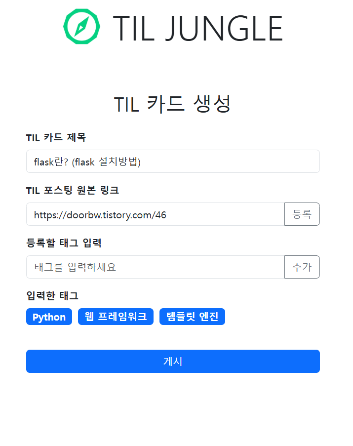 | 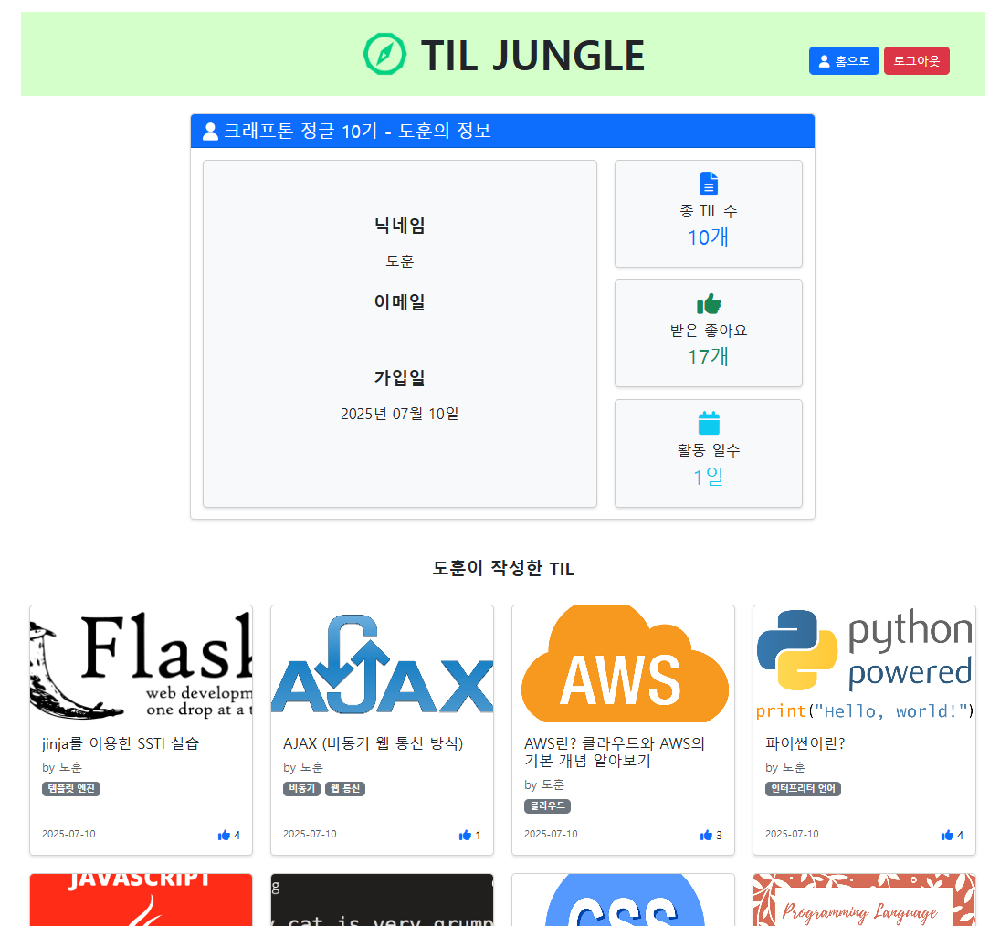 |

- **카드 생성 시 validators를 통한 올바른 URL 검증 수행**
- **Slack User 정보를 바탕으로 사용자별 모든 정보 렌더링**

## Slack

|        질문하기        |         대화 내용 수집        |
| :------------------: | :--------------------: |
| 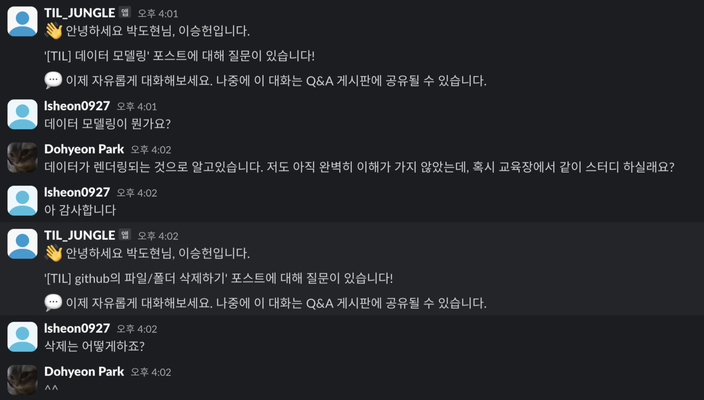 | 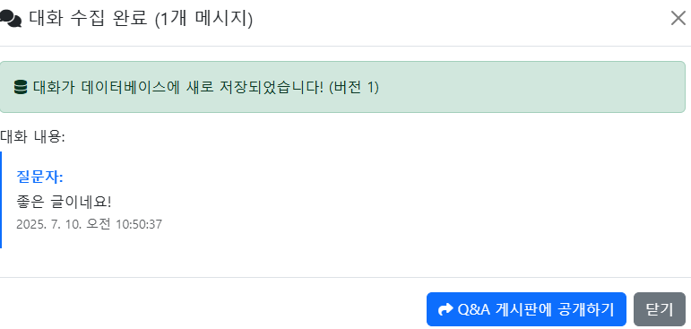 |

질문하기 버튼 클릭 시 해당 TIL 작성자와의 1:1 DM 채널 생성 <br>
대화수집 버튼 클릭 시 작성자와 대화한 모든 기록을 수집하며 데이터베이스에 저장, 수집 시점을 바탕으로 버전 별 관리

- **대화방으로 이동하면 슬랙 봇이 포스팅 제목 및 안내 메세지 전송**
- **MPIM방식으로 DM 채널을 생성, 동일 작성자의 다른 포스팅에 대한 질문시, 기존 생성된 대화방으로 이동하는 채널 재사용 기능 구현**
- **conversation.history API를 이용해 대화 내용 수집 기능 구현**
- **슬랙 봇의 최신 메세지 전송 타임스탬프를 기준으로 버전 관리 및 QNA 섹션 분리**

|        Q&A 게시판        |         Q&A 내용 공개        |
| :------------------: | :--------------------: |
| 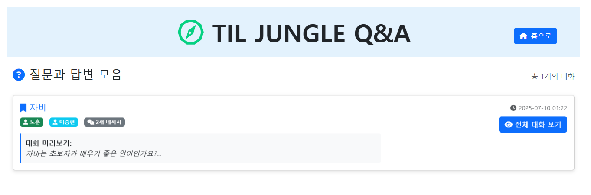 | 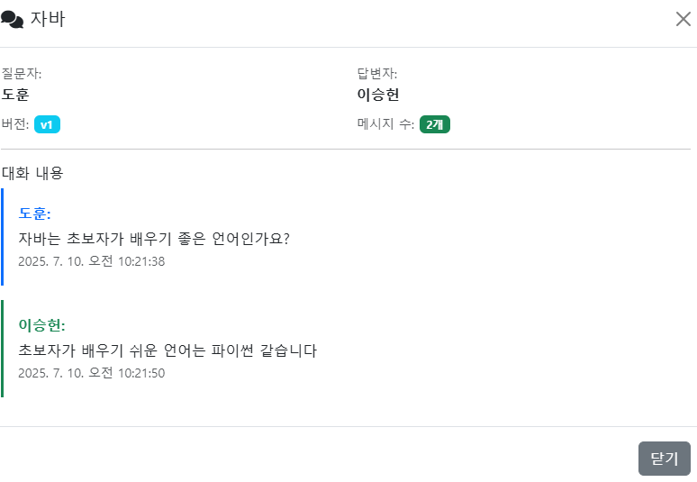 |

수집한 대화를 바탕으로 비공개 대화를 전체 공개 게시판에 등록 <br>
다른 유저가 대화 내용에 접근할 수 있도록 구현


## 🛠️ 기술 스택

### 프론트엔드
<p style="display:flex; gap:10px">
    
    
    
</p>

### 백엔드
<p style="display:flex; gap:10px">
    
    
    
</p>

### 데이터베이스
<p style="display:flex; gap:10px">
    
</p>

### 배포
<p style="display:flex; gap:10px">
    
</p>

## 아키텍처
```markdown
┌────────────────────────────────────────────────────────────────────────────────┐
│                            AWS EC2 (우분투) 배포 환경                              │
│                                                                                │
│ ┌────────────────────────────────────────────────────────────────────────────┐ │
│ │                           FRONTEND (브라우저)                                │ │
│ │                                                                            │ │
│ │  ┌──────────┐  ┌───────────┐  ┌───────────┐  ┌───────────┐  ┌────────────┐ │ │
│ │  │login.html│  │ home.html │  │ post.html │  │mypage.html│  │qna_board   │ │ │
│ │  │          │  │           │  │           │  │           │  │.html       │ │ │
│ │  │ SSR 렌더링 │  │ SSR 렌더링  │  │ TIL 작성   │  │ 마이페이지  │   │ Q&A 게시판  │ │ │
│ │  │ 이메일인증  │  │ 무한스크롤   │  │ URL 검증   │  │ 사용자통계  │   │ 대화조회     │ │ │
│ │  │ JWT 쿠키  │  │  좋아요     │  │ 태그추가    │  │ TIL 목록   │  │ 공개설정      │ │ │
│ │  └──────────┘  └───────────┘  └───────────┘  └───────────┘  └────────────┘ │ │
│ │                     │               │              │                       │ │
│ │              ┌──────┴──────┐        │              │                       │ │
│ │              │ JavaScript  │        │              │                       │ │
│ │              │ + jQuery    │        │              │                       │ │
│ │              │ + Bootstrap5│        │              │                       │ │
│ │              └─────────────┘        │              │                       │ │
│ └─────────────────────────────────────┼──────────────┼───────────────────────┘ │
│                                       │              │                         │
│    ┌──────────────────────────────────┼──────────────┼─────────────────────┐   │
│    │  HTTPS/AJAX (JSON API 통신)       │              │                     │   │
│    └──────────────────────────────────┼──────────────┼─────────────────────┘   │
│                                       │              │                         │
│ ┌─────────────────────────────────────┼──────────────┼───────────────────────┐ │
│ │                    BACKEND (Flask MVC 패턴)                                 │ │
│ │                                    │              │                        │ │
│ │  ┌────────────────┐  ┌─────────────┼──────────────┼────────────┐           │ │
│ │  │ Flask App      │  │             │              │            │           │ │
│ │  │ (app.py)       │  │        라우트 모듈 통합                     │           │ │
│ │  │                │  │             │              │            │           │ │
│ │  │ ├─ Jinja2      │  │  ┌──────────┴──────────────┴─────────┐  │           │ │
│ │  │ ├─ Flask-CORS  │  │  │       라우트 핸들러                  │  │           │ │
│ │  │ ├─ JWT         │  │  │                                   │  │           │ │
│ │  │ └─ PyMongo     │  │  │ ├─ GET /, /signup (SSR)           │  │           │ │
│ │  └────────────────┘  │  │ ├─ POST /auth/register, /login    │  │           │ │
│ │                      │  │ ├─ GET /home (TIL 목록)            │  │           │ │
│ │  ┌────────────────┐  │  │ ├─ GET /post, /mypage (SSR)       │  │           │ │
│ │  │ Slack API      │  │  │ ├─ GET /qna (Q&A 게시판)            │  │           │ │
│ │  │ Integration    │  │  │ ├─ POST /models/post_card         │  │           │ │
│ │  │                │  │  │ ├─ POST /models/create-dm         │  │           │ │
│ │  │ ├─ OAuth2      │  │  │ ├─ POST /models/collect-conversation│ │          │ │
│ │  │ ├─ DM 생성      │  │  │ ├─ POST /models/like_card/<id>    │  │           │ │
│ │  │ ├─ 대화수집      │  │  │ └─ GET /models/load_cards         │  │           │ │
│ │  │ └─ 메타데이터     │  │  └───────────────────────────────────┘  │          │ │
│ │  └────────────────┘  └─────────────────────────────────────────┘          │ │
│ │                                                                           │ │
│ │  ┌──────────────────────────────────────────────────────────────────────┐ │ │
│ │  │                            모델 레이어                                  │ │ │
│ │  │                                                                      │ │ │
│ │  │  ┌────────────┐  ┌──────────────┐  ┌──────────────────┐              │ │ │
│ │  │  │ User       │  │ Card         │  │ Conversation     │              │ │ │
│ │  │  │ Model      │  │ Model        │  │ Model            │              │ │ │
│ │  │  │            │  │              │  │                  │              │ │ │
│ │  │  │├─_id       │  │├─_id         │  │├─_id             │              │ │ │
│ │  │  │├─name      │  │├─title       │  │├─card_id         │              │ │ │
│ │  │  │├─email     │  │├─author      │  │├─questioner_id   │              │ │ │
│ │  │  │├─password  │  │├─author_id   │  │├─author_id       │              │ │ │
│ │  │  │├─slack_*   │  │├─img         │  │├─messages[]      │              │ │ │
│ │  │  │├─avatar_url│  │├─tag_list    │  │├─version         │              │ │ │
│ │  │  │└─created_at│  │├─likes       │  │├─is_published    │              │ │ │
│ │  │  │            │  │├─liked_users │  │└─created_at      │              │ │ │
│ │  │  │            │  │├─url         │  │                  │              │ │ │
│ │  │  │            │  │└─date        │  │                  │              │ │ │
│ │  │  └────────────┘  └──────────────┘  └──────────────────┘              │ │ │
│ │  └──────────────────────────────────────────────────────────────────────┘ │ │
│ └───────────────────────────────────────────────────────────────────────────┘ │
│                                       │                                       │
│ ┌─────────────────────────────────────┼─────────────────────────────────────┐ │
│ │                           DATABASE  │                                     │ │
│ │                                     │                                     │ │
│ │  ┌──────────────────────────────────┼──────────────────────────────────┐  │ │
│ │  │             MongoDB Atlas (원격) 또는 로컬                             │  │ │
│ │  │                                  │                                  │  │ │
│ │  │  ┌─────────────┐  ┌─────────────┐┌─────────────┐ ┌─────────────┐    │  │ │
│ │  │  │   users     │  │   cards     ││conversations│ │email_verif  │    │  │ │
│ │  │  │ Collection  │  │ Collection  ││ Collection  │ │ Collection  │    │  │ │
│ │  │  │             │  │             ││             │ │             │    │  │ │
│ │  │  │ - _id       │  │ - _id       ││ - _id       │ │ - email     │    │  │ │
│ │  │  │ - name      │  │ - title     ││ - card_id   │ │ - code      │    │  │ │
│ │  │  │ - email     │  │ - author    ││ - messages  │ │ - expires_at│    │  │ │
│ │  │  │ - password  │  │ - author_id ││ - version   │ │ - verified  │    │  │ │
│ │  │  │ - slack_*   │  │ - img       ││ - published │ │ - created_at│    │  │ │
│ │  │  │ - avatar_url│  │ - tag_list  ││ - channel_id│ │             │    │  │ │
│ │  │  │ - created_at│  │ - likes     ││ - created_at│ │             │    │  │ │
│ │  │  │             │  │ - url       ││             │ │             │    │  │ │
│ │  │  └─────────────┘  └─────────────┘└─────────────┘ └─────────────┘    │  │ │
│ │  └─────────────────────────────────────────────────────────────────────┘  │ │
│ └───────────────────────────────────────────────────────────────────────────┘ │
│                                                                               │
│ ┌───────────────────────────────────────────────────────────────────────────┐ │
│ │                              인증 시스템                                     │ │
│ │                                                                           │ │
│ │  ┌─────────────────────────────────────────────────────────────────────┐  │ │
│ │  │               듀얼 인증 시스템 (이메일 + Slack)                           │  │ │
│ │  │                                                                     │  │ │
│ │  │  ┌─────────────────┐    ┌─────────────────┐                         │  │ │
│ │  │  │ 이메일 인증        │    │ JWT 토큰 인증     │                         │  │ │
│ │  │  │ - 6자리 코드      │    │ - 2시간 만료      │                         │  │ │
│ │  │  │ - 5분 만료        │    │ - httpOnly 쿠키  │                         │  │ │
│ │  │  │ - SMTP Gmail    │    │ - HS256 서명     │                          │  │ │
│ │  │  └─────────────────┘    └─────────────────┘                          │  │ │
│ │  │                                                                      │  │ │
│ │  │  ┌─────────────────┐    ┌─────────────────┐                          │  │ │
│ │  │  │ Slack 워크스페이스│     │ 세션 관리          │                          │  │ │
│ │  │  │ - 자동 매칭      │     │ - 쿠키 기반        │                          │  │ │
│ │  │  │ - 프로필 동기화   │     │ - 로그아웃 처리     │                          │  │ │
│ │  │  │ - DM 권한       │     │ - 만료 처리        │                         │  │ │
│ │  │  └─────────────────┘    └─────────────────┘                          │  │ │
│ │  └──────────────────────────────────────────────────────────────────────┘  │ │
│ └────────────────────────────────────────────────────────────────────────────┘ │
│                                                                                │
│ ┌────────────────────────────────────────────────────────────────────────────┐ │
│ │                           Slack 연동 플로우                                   │ │
│ │                                                                            │ │
│ │ 1. 질문하기 클릭 → Slack DM 채널 생성 (메타데이터 포함)                              │ │
│ │ 2. 환영 메시지 발송 → 카드 정보를 메타데이터로 임베드                                  │ │
│ │ 3. 실시간 대화 진행 → Slack 앱에서 자유로운 Q&A                                    │ │
│ │ 4. 대화수집 버튼 클릭 → 특정 카드 관련 대화만 필터링                                   │ │
│ │ 5. 메시지 역할 구분 → 질문자/작성자 자동 분류                                        │ │
│ │ 6. MongoDB 저장 → 버전 관리로 대화 업데이트                                        │ │
│ │ 7. Q&A 게시판 공개 → 개인 대화를 공개 지식으로 전환                                   │ │
│ └─────────────────────────────────────────────────────────────────────────────┘ │
│                                                                                │
│ ┌────────────────────────────────────────────────────────────────────────────┐ │
│ │                           외부 API 연동                                       │ │
│ │                                                                             │ │
│ │ ┌─────────────────┐ ┌─────────────────┐ ┌─────────────────┐                 │ │
│ │ │   Slack API     │ │   SMTP Gmail    │ │  블로그 크롤링     │                 │ │
│ │ │                 │ │                 │ │                 │                 │ │
│ │ │ ├─ OAuth2       │ │ ├─ 인증코드발송    │ │ ├─ og:image      │                │ │
│ │ │ ├─ users.list   │ │ ├─ 계정인증       │ │ ├─ 썸네일추출       │                │ │
│ │ │ ├─ conversations│ │ ├─ 비밀번호재설정   │ │ ├─ Velog/Tistory │                │ │
│ │ │ ├─ chat.post    │ │ └─ 알림메일       │ │ └─ BeautifulSoup │                │ │
│ │ │ └─ history      │ │                 │ │                 │                 │ │
│ │ └─────────────────┘ └─────────────────┘ └─────────────────┘                 │ │
│ └─────────────────────────────────────────────────────────────────────────────┘ │
└─────────────────────────────────────────────────────────────────────────────────┘
```
